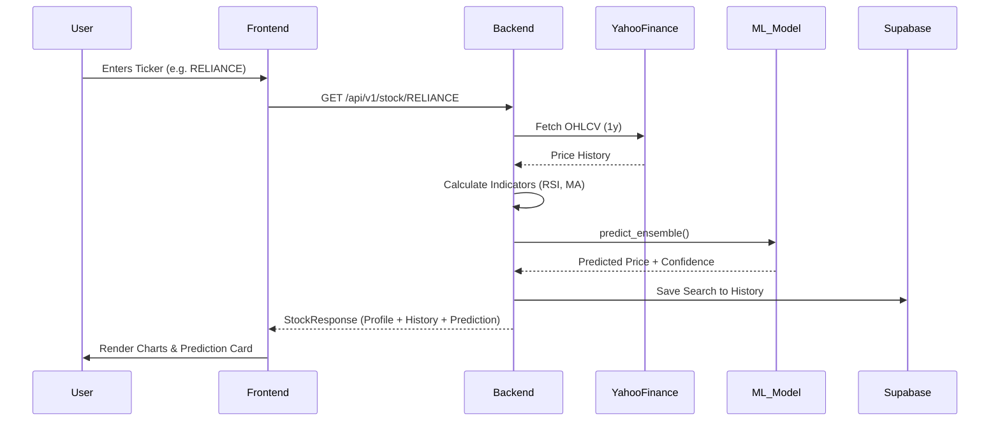
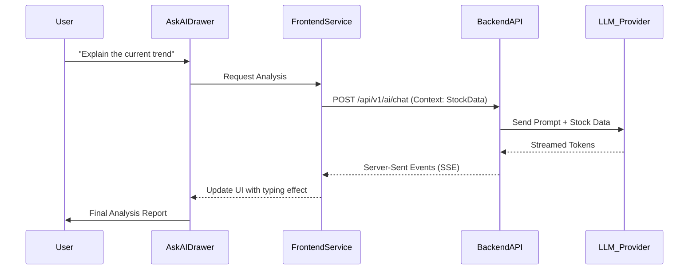

# System Flow Diagrams

## 1. Stock Search & Analysis Flow

```mermaid
sequenceDiagram
    participant User
    participant Frontend
    participant Backend
    participant YahooFinance
    participant ML_Model
    participant Supabase

    User->>Frontend: Enters Ticker (e.g. RELIANCE)
    Frontend->>Backend: GET /api/v1/stock/RELIANCE
    Backend->>YahooFinance: Fetch OHLCV (1y)
    YahooFinance-->>Backend: Price History
    Backend->>Backend: Calculate Indicators (RSI, MA)
    Backend->>ML_Model: predict_ensemble()
    ML_Model-->>Backend: Predicted Price + Confidence
    Backend->>Supabase: Save Search to History
    Backend-->>Frontend: StockResponse (Profile + History + Prediction)
    Frontend->>User: Render Charts & Prediction Card
```

## 2. AI Analysis Flow

```mermaid
sequenceDiagram
    participant User
    participant AskAIDrawer
    participant FrontendService
    participant BackendAPI
    participant LLM_Provider

    User->>AskAIDrawer: "Explain the current trend"
    AskAIDrawer->>FrontendService: Request Analysis
    FrontendService->>BackendAPI: POST /api/v1/ai/chat (Context: StockData)
    BackendAPI->>LLM_Provider: Send Prompt + Stock Data
    LLM_Provider-->>BackendAPI: Streamed Tokens
    BackendAPI-->>FrontendService: Server-Sent Events (SSE)
    FrontendService-->>AskAIDrawer: Update UI with typing effect
    AskAIDrawer->>User: Final Analysis Report
```
