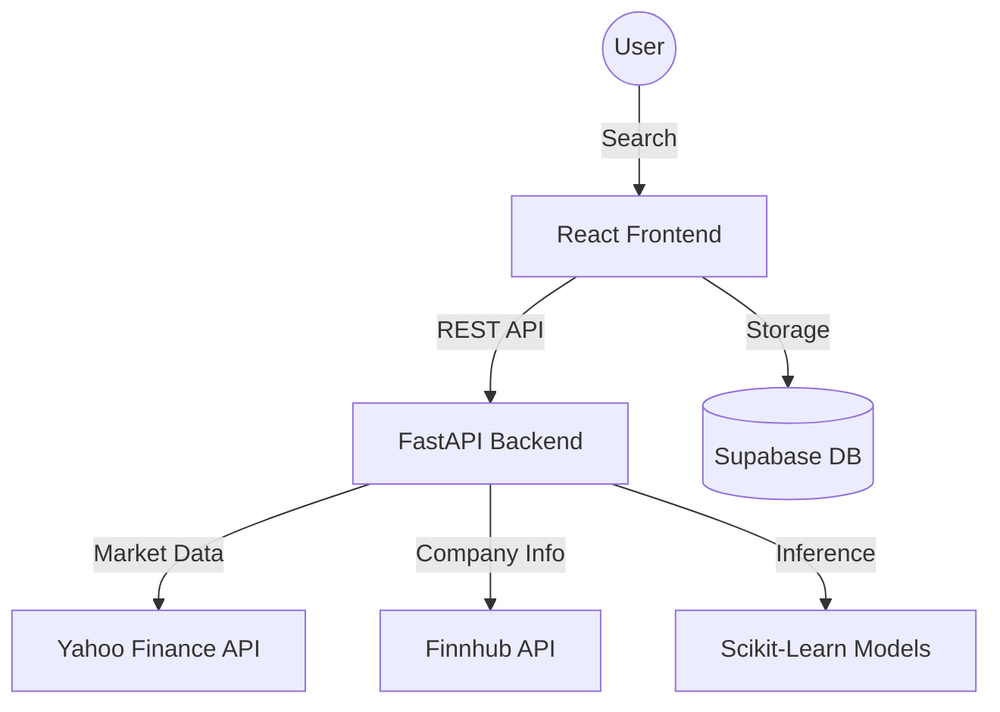

# 📈 Stock Intelligence Dashboard

A production-grade stock analysis and prediction platform powered by **Python FastAPI** and **React**.

## 🏆 Engineering Excellence & Compliance
This repository adheres to the highest standards of software quality and maintainability.

- **10/10 Pylint Score:** Backend code follows strict PEP 8 and professional coding standards.
- **Strict Mypy Type Safety:** 100% type coverage across the entire Python backend.
- **Modern Linting & Formatting:** Powered by **Ruff** for sub-millisecond linting and **Flake8** for standard compliance.
- **Security Scanned:** Automated security policy checks using **Semgrep** and **Gitleaks**.
- **Spec-Driven Development:** Initialized with **Spec-Kit** for robust architecture and planning.

## 🏗 Architecture
The system follows a **Single Backend Architecture** for high consistency and ML precision.



## 📂 Folder Structure
```text
├── .specify/             # Spec-Kit (Memory, Templates, Specs)
├── backend/              # Unified FastAPI Backend
│   ├── api/              # Endpoints & Routes
│   ├── services/         # Yahoo/Finnhub/Stock logic
│   ├── ml/               # Prediction Models (RF, Linear)
│   ├── features/         # Technical Indicator Engineering
│   ├── core/             # Config & Logging
│   └── tests/            # Integrated Unit & Integration Tests
├── frontend/             # React + Vite (UI Layer)
│   ├── src/services/     # API Clients
│   └── src/components/   # Data Visualization
└── run.py                # Root Entry Point
```

## 🚀 Setup & Installation

### 1. Environment Variables

Create a `.env` in the `backend/` folder:
```env
SUPABASE_URL=https://your-supabase-project.supabase.co
SUPABASE_ANON_KEY=your-anon-key
SUPABASE_SERVICE_ROLE_KEY=your-service-role-key
ADMIN_EMAILS=routsoumyajit18@gmail.com,soumyajitrout24@gmail.com
GOOGLE_AUTH_ENABLED=true
FRONTEND_URL=http://localhost:5173
CORS_ORIGINS=http://localhost:5173,http://localhost:5174
FINNHUB_API_KEY=your_finnhub_key
AI_PROVIDER=groq
GROQ_API_KEY=your-groq-key
DEFAULT_GROQ_API_KEY=your-groq-key
AI_MODEL=llama-3.1-8b-instant
AI_REQUEST_TIMEOUT_SECONDS=45
```

Create a `.env` in the `frontend/` folder:
```env
VITE_API_URL=http://localhost:8000/api/v1
VITE_SUPABASE_URL=https://your-supabase-project.supabase.co
VITE_SUPABASE_PUBLISHABLE_KEY=your-publishable-key
VITE_SUPABASE_ANON_KEY=your-anon-key
VITE_APP_URL=http://localhost:5173
VITE_ADMIN_EMAILS=routsoumyajit18@gmail.com,soumyajitrout24@gmail.com
```

`VITE_API_URL` must point at the FastAPI backend: `http://localhost:8000/api/v1`.
Do not use `http://localhost:5173/api/v1` for backend requests. The Vite dev server
runs the frontend only.

### 2. Database Setup (Supabase CLI First)

Supabase CLI migrations are the primary database workflow:

```bash
npx supabase login
npx supabase link --project-ref YOUR_PROJECT_REF
npx supabase db push
npx supabase gen types typescript --linked --schema public > frontend/src/types/supabase.ts
```

Do not run `npx supabase db reset` against hosted production data. Google OAuth Client ID/Secret are still configured in the Supabase Dashboard under Authentication providers.

The root-level `supabase_setup.sql` and `supabase_admin_dashboard_fix.sql` files remain manual fallback scripts for the Supabase Dashboard SQL Editor.

#### Web Dashboard Verification Check:
* Go to the **Table Editor** on your Supabase Web Dashboard.
* Confirm that the `public.user_profiles` and `public.feedback_issues` tables exist.
* Verify user signup tracking works by running `select count(*) as total_users from public.user_profiles;` in the SQL Editor.
* If Total Users is `0` after existing users have signed in, run the root-level `supabase_admin_dashboard_fix.sql` in the SQL Editor to backfill `auth.users` into `public.user_profiles` and relink old feedback rows by email.

Useful verification queries:

```sql
select count(*) as total_users
from public.user_profiles;
```

```sql
select email, full_name, provider, first_seen_at, last_seen_at
from public.user_profiles
order by first_seen_at desc;
```

```sql
select f.title, f.category, f.status, f.email, p.full_name, f.created_at
from public.feedback_issues f
left join public.user_profiles p on p.id = f.user_id
order by f.created_at desc;
```

```sql
select date(first_seen_at) as signup_date, count(*) as signups
from public.user_profiles
group by date(first_seen_at)
order by signup_date desc;
```

### 3. Backend Setup (FastAPI)
```bash
python -m venv .venv
# Activate venv (Windows: .venv\Scripts\activate | Unix: source .venv/bin/activate)
pip install -r backend/requirements.txt
python run.py
```
*Note:* The backend binds to `0.0.0.0:8000` internally, which is a bind address. To access the backend or API docs in your browser, navigate to:
* **Local Backend API:** [http://localhost:8000](http://localhost:8000)
* **API Documentation:** [http://localhost:8000/docs](http://localhost:8000/docs)

### 4. Frontend Setup (React)
```bash
cd frontend
npm install
npm run dev
```
Open **Local Frontend URL:** [http://localhost:5173](http://localhost:5173) in your browser.

### 5. Authentication Landing Gate
When first loading the frontend, users are greeted with a beautiful, secure Google Login landing page gate. Access to the main dashboard is restricted until a user logs in. The redirect callback is processed at `/auth/callback`.

The frontend sends `Authorization: Bearer <Supabase access token>` to protected
backend endpoints. It never sends the Supabase anon key, refresh token, or service
role key as a bearer token.

Frontend Supabase config uses `VITE_SUPABASE_PUBLISHABLE_KEY` first and falls back to `VITE_SUPABASE_ANON_KEY`. The backend service role key remains server-side only.

User-owned data is saved per Supabase authenticated user:
* Watchlist rows use `user_id = auth.users.id`.
* Search history rows use `user_id = auth.users.id`.
* Feedback rows use `user_id = auth.users.id`.
* Admin stats are available only when the authenticated email is in `ADMIN_EMAILS`.
* Admin stats include user names/emails/avatars only for allowlisted admin sessions.

### 6. Interactive UI Tools
The dashboard offers separate UI widgets at the bottom:
* **Ask AI:** Accessible via the Navbar or a floating bottom-right action button (`bottom-5`).
* **Report Issue / Request Feature:** Accessible via a smaller, clean dark button at the bottom-right (`bottom-20`), ensuring no overlap with core chart tools. If logged out, it prompts the user to log in with Google to submit reports.

Ask AI and AI Report Generator use backend AI routes only. AI provider keys are
configured in the backend environment, never in frontend `.env` files or browser
storage. If Render is missing `GROQ_API_KEY` or `DEFAULT_GROQ_API_KEY`, the API
returns `AI_PROVIDER_NOT_CONFIGURED` with a safe setup hint. Financial questions
are answered as educational analysis, risks, and limitations, not personalized
investment advice.

Production deployment uses Render for the backend and Vercel for the frontend.
Set Vercel `VITE_API_URL` to the Render backend URL ending in `/api/v1`, and set
Render `CORS_ORIGINS` to include `https://smart-stock18.vercel.app`. See
`docs/deployment.md` for the full variable lists and troubleshooting checklist.

Stock data uses Yahoo Finance for history/quote data and Finnhub plus Yahoo
fallbacks for company profile fields. Backend caches quote/profile/history and
reuses already-fetched history for predictions so profile failures do not block
price/chart rendering.

## 🧪 Quality Control & Testing
We use a comprehensive suite of tools to ensure stability:

```bash
# Run all tests with coverage
pytest --cov=backend --cov-report=xml

# Run linting checks
ruff check .
flake8 .
pylint backend

# Run type checking
mypy backend run.py
```

## 🔄 CI/CD Pipeline
The project features a full-lifecycle **GitLab CI** pipeline with the following stages:
1. **Format:** Ensures consistent code style (Ruff).
2. **Lint:** Validates PEP 8 and code quality (Flake8, Pylint).
3. **Type Check:** Enforces strict typing (Mypy).
4. **Security:** Scans for vulnerabilities (Semgrep, Gitleaks).
5. **Test:** Executes backend and frontend test suites.
6. **Coverage:** Generates and enforces test coverage (>80%).
7. **Build:** Creates production Docker images.
8. **Release:** Automated changelog generation and tagging.

## 🧠 ML Implementation
- **Models:** Random Forest Regressor & Linear Regression.
- **Feature Engineering:** Automated technical indicators (MA7, MA21, RSI, MACD, etc.).
- **Evaluation:** Real-time metrics (RMSE, MAE, R2) for every prediction.

added Pipeline runner.

## ⚠️ Known Issues
- **API Rate Limits:** Finnhub API limits apply to the free tier (60 calls/min).
- **Data Delay:** Yahoo Finance data may be delayed by 15-20 minutes for certain exchanges.

## 🔮 Future Improvements
- **Real-time Streaming:** Integration with WebSockets for live ticker updates.
- **Sentiment Analysis:** Adding news sentiment from Finnhub to the ML feature set.
- **Redis Caching:** Implementing a dedicated caching layer for high-traffic tickers.
