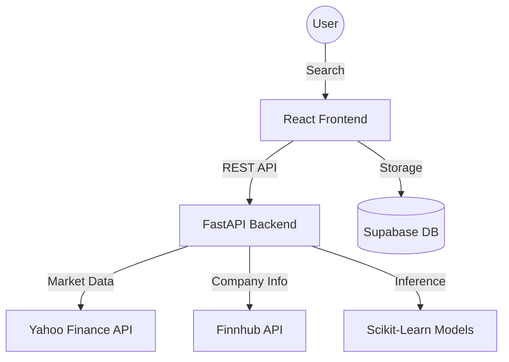

# 📈 Stock Intelligence Dashboard

A production-grade stock analysis and prediction platform powered by **Python FastAPI** and **React**.

## 🏗 Architecture
The system follows a **Single Backend Architecture** for high consistency and ML precision.



## 📂 Folder Structure
```text
├── frontend/             # React + Vite (UI Layer)
│   ├── src/services/     # API Clients
│   └── src/components/   # Data Visualization
├── backend/              # Unified FastAPI Backend
│   ├── api/              # Endpoints & Routes
│   ├── services/         # Yahoo/Finnhub/Stock logic
│   ├── ml/               # Prediction Models (RF, Linear)
│   ├── features/         # Technical Indicator Engineering
│   └── core/             # Config & Logging
└── supabase/             # Persistence Layer
    └── migrations/       # SQL Schema
```

## 🚀 Setup & Installation

### 1. Environment Variables
Create a `.env` in the `backend/` folder:
```env
SUPABASE_URL=your_supabase_url
SUPABASE_SERVICE_ROLE_KEY=your_service_key
FINNHUB_API_KEY=your_finnhub_key
```

Create a `.env` in the `frontend/` folder:
```env
VITE_SUPABASE_URL=your_supabase_url
VITE_SUPABASE_ANON_KEY=your_anon_key
VITE_API_URL=http://localhost:8000/api/v1
```

### 2. Backend Setup (FastAPI)
```bash
cd backend
python -m venv venv
source venv/bin/activate
pip install -r requirements.txt
uvicorn main:app --reload
```

### 3. Frontend Setup (React)
```bash
cd frontend
npm install
npm run dev
```

## 🧪 Observability & Debugging
The backend provides dedicated endpoints for system health and data pipeline transparency:
- **Health Check:** `GET /api/v1/health`
- **System Metrics:** `GET /api/v1/debug/metrics`
- **Pipeline Trace:** `GET /api/v1/debug/data-pipeline/{ticker}` (Detailed latency & merge logs)

## 🧠 ML Implementation
- **Models:** Random Forest Regressor & Linear Regression.
- **Feature Engineering:** 7-day and 21-day Moving Averages, RSI, and Volume Lagging.
- **Deterministic:** Predictions are generated based on historical data patterns with zero randomization.

## ⚠️ Known Issues
- **API Rate Limits:** Finnhub API limits apply to the free tier (60 calls/min).
- **Data Delay:** Yahoo Finance data may be delayed by 15-20 minutes for certain exchanges.

## 🔮 Future Improvements
- **Real-time Streaming:** Integration with WebSockets for live ticker updates.
- **Sentiment Analysis:** Adding news sentiment from Finnhub to the ML feature set.
- **Redis Caching:** Implementing a dedicated caching layer for high-traffic tickers.
