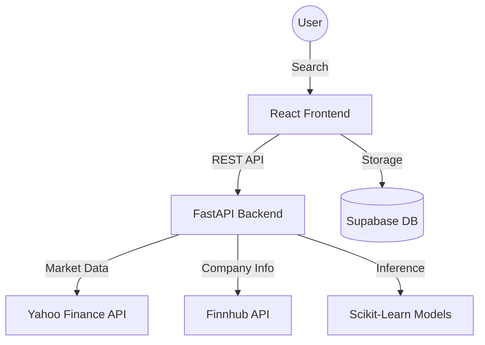

# 📈 Stock Intelligence Dashboard

A production-grade stock analysis and prediction platform powered by **Python FastAPI** and **React**.

## 🏆 Engineering Excellence & Compliance
This repository adheres to the highest standards of software quality and maintainability.

- **10/10 Pylint Score:** Backend code follows strict PEP 8 and professional coding standards.
- **Strict Mypy Type Safety:** 100% type coverage across the entire Python backend.
- **Modern Linting & Formatting:** Powered by **Ruff** for sub-millisecond linting and **Flake8** for standard compliance.
- **Security Scanned:** Automated security policy checks using **Semgrep** and **Gitleaks**.
- **Spec-Driven Development:** Initialized with **Spec-Kit** for robust architecture and planning.

## 🏗 Architecture
The system follows a **Single Backend Architecture** for high consistency and ML precision.



## 📂 Folder Structure
```text
├── .specify/             # Spec-Kit (Memory, Templates, Specs)
├── backend/              # Unified FastAPI Backend
│   ├── api/              # Endpoints & Routes
│   ├── services/         # Yahoo/Finnhub/Stock logic
│   ├── ml/               # Prediction Models (RF, Linear)
│   ├── features/         # Technical Indicator Engineering
│   ├── core/             # Config & Logging
│   └── tests/            # Integrated Unit & Integration Tests
├── frontend/             # React + Vite (UI Layer)
│   ├── src/services/     # API Clients
│   └── src/components/   # Data Visualization
└── run.py                # Root Entry Point
```

## 🚀 Setup & Installation

### 1. Environment Variables
Create a `.env` in the `backend/` folder:
```env
SUPABASE_URL=your_supabase_url
SUPABASE_SERVICE_ROLE_KEY=your_service_key
FINNHUB_API_KEY=your_finnhub_key
```

### 2. Backend Setup (FastAPI)
```bash
python -m venv .venv
# Activate venv (Windows: .venv\Scripts\activate | Unix: source .venv/bin/activate)
pip install -r backend/requirements.txt
python run.py
```

### 3. Frontend Setup (React)
```bash
cd frontend
npm install
npm run dev
```

## 🧪 Quality Control & Testing
We use a comprehensive suite of tools to ensure stability:

```bash
# Run all tests with coverage
pytest --cov=backend --cov-report=xml

# Run linting checks
ruff check .
flake8 .
pylint backend

# Run type checking
mypy backend run.py
```

## 🔄 CI/CD Pipeline
The project features a full-lifecycle **GitLab CI** pipeline with the following stages:
1. **Format:** Ensures consistent code style (Ruff).
2. **Lint:** Validates PEP 8 and code quality (Flake8, Pylint).
3. **Type Check:** Enforces strict typing (Mypy).
4. **Security:** Scans for vulnerabilities (Semgrep, Gitleaks).
5. **Test:** Executes backend and frontend test suites.
6. **Coverage:** Generates and enforces test coverage (>80%).
7. **Build:** Creates production Docker images.
8. **Release:** Automated changelog generation and tagging.

## 🧠 ML Implementation
- **Models:** Random Forest Regressor & Linear Regression.
- **Feature Engineering:** Automated technical indicators (MA7, MA21, RSI, MACD, etc.).
- **Evaluation:** Real-time metrics (RMSE, MAE, R2) for every prediction.

## ⚠️ Known Issues
- **API Rate Limits:** Finnhub API limits apply to the free tier (60 calls/min).
- **Data Delay:** Yahoo Finance data may be delayed by 15-20 minutes for certain exchanges.

## 🔮 Future Improvements
- **Real-time Streaming:** Integration with WebSockets for live ticker updates.
- **Sentiment Analysis:** Adding news sentiment from Finnhub to the ML feature set.
- **Redis Caching:** Implementing a dedicated caching layer for high-traffic tickers.
