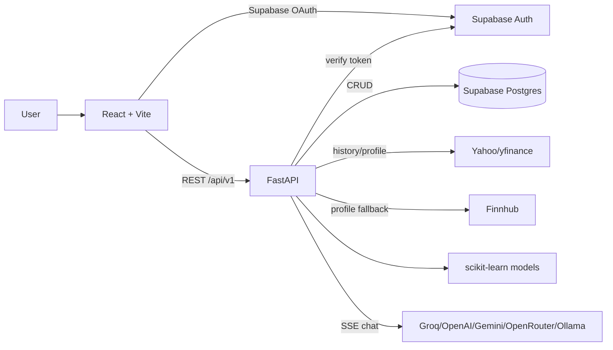

# Stock Intelligence Dashboard Repository Analysis

Generated from the current working tree at `C:\Users\soumy\stock_dashB` plus git metadata available in `.git`. Evidence is limited to files, configuration, documentation, migrations, git outputs, and commands run locally. Any unverified claim is marked `Not Found` or `Cannot be determined from the repository`.

## Executive Summary

The project is a full-stack stock analysis dashboard for searching equities, viewing historical OHLCV charts, generating next-day price predictions, saving watchlists/search history/predictions, submitting feedback, viewing admin usage/feedback stats, and using LLM-backed stock Q&A/report generation. Evidence: `README.md`, `frontend/src/pages/Dashboard.tsx`, `backend/api/routes.py`, `backend/services/stock_service.py`, `backend/services/ai_service.py`.

Intended users are individual investors, students, researchers, traders, and analysts, per `docs/model-card.md`. The domain is fintech / public-market analytics. The project differentiates itself from a plain charting app by combining FastAPI-backed market data, scikit-learn prediction models, Supabase-authenticated user data, feedback/admin operations, multilingual UI, and AI report/chat workflows. Confidence: High. Evidence: `docs/model-card.md`, `frontend/src/services/aiProviderService.ts`, `backend/ml/*`.

High-level architecture: React/Vite frontend + Zustand/React Query state, FastAPI backend, Supabase PostgreSQL/Auth, Yahoo Finance/yfinance and Finnhub data providers, scikit-learn ML models, optional external LLM APIs. Confidence: High. Evidence: `frontend/package.json`, `backend/requirements.txt`, `backend/main.py`, `backend/api/routes.py`, `supabase/migrations/*.sql`.

Main workflow: authenticated user signs in via Supabase Google OAuth, searches ticker, frontend calls `GET /api/v1/stock/{ticker}`, backend fetches price/profile data, engineers features, runs or loads ML model, returns `StockResponse`, UI renders charts/profile/prediction, optional watchlist/history/feedback/admin/AI calls persist or stream data. Confidence: High. Evidence: `frontend/src/store/auth_store.ts`, `frontend/src/hooks/useStock.ts`, `frontend/src/services/api_client.ts`, `backend/api/routes.py`, `backend/services/stock_service.py`.

Important current-state caveat: backend tests fail at import time because current working tree is missing tracked `backend/data/provider.py`, `backend/data/cache.py`, and `backend/data/__init__.py`; `git status --short` shows them deleted, while `git ls-tree HEAD` shows them tracked. Command output: `python -m pytest backend\tests -q` failed with `ModuleNotFoundError: No module named 'data'`. Confidence: High.

## Architecture

Frontend architecture: `frontend/src/App.tsx` creates a React Query `QueryClient` with `staleTime: 5 * 60 * 1000`, `gcTime: 30 * 60 * 1000`, retry `2`, and a manual route state (`currentRoute`) instead of React Router. Zustand stores exist for auth (`auth_store.ts`), stock state (`stock_store.tsx`), and UI (`ui_store.ts`). Dashboard composition happens in `frontend/src/pages/Dashboard.tsx`. Confidence: High.

Backend architecture: FastAPI app in `backend/main.py` includes `api.routes` at `/api/v1`, adds CORS from `core.config`, logs each HTTP request with duration/status, serves built frontend if `frontend/dist` exists, and exposes `/` and `/favicon.ico`. Routes are centralized in `backend/api/routes.py`; business logic is in `backend/services`; ML is in `backend/ml`; schemas are Pydantic models in `backend/schemas/stock_schema.py`. Confidence: High.

Database architecture: Supabase migrations define `watchlists`, `search_history`, `predictions`, `saved_models`, `user_profiles`, and `feedback_issues`, plus older `users`. RLS is enabled and policies scope user-owned data to `auth.uid()` in later migrations. Indexes exist for user/ticker/date/status/category fields. Confidence: High. Evidence: `supabase/migrations/20260626000300_admin_profiles_cli_consolidation.sql`.

API architecture: 24 FastAPI route decorators were measured in `backend/api/routes.py`: health, Supabase health, AI health, auth sync, debug stock data, stock lookup, watchlist CRUD, history CRUD, predictions read/write, AI chat/models/test, feedback, and admin stats/feedback/user-count. Confidence: High.

Authentication flow: frontend calls `supabase.auth.signInWithOAuth({ provider: 'google' })`; backend protected endpoints require `Authorization: Bearer <token>` and validate token through `client.auth.get_user(token)` unless mock mode is active. Admin access is email allowlist-based via `ADMIN_EMAILS`. Confidence: High. Evidence: `frontend/src/store/auth_store.ts`, `backend/core/auth.py`.

Authorization flow: backend dependencies `require_authenticated_user` and `require_admin_user` protect endpoints; database RLS also enforces user-scoped rows for Supabase clients. Confidence: High. Evidence: `backend/api/routes.py`, `backend/core/auth.py`, `supabase/migrations/*.sql`.

Request lifecycle for stock lookup: `Dashboard` -> `useStock` -> `api.getStock` -> `GET /stock/{ticker}` -> `StockService.get_full_stock_analysis` -> provider calls with `asyncio.gather` -> metadata merge -> indicators -> ML prediction -> `StockResponse`. Confidence: High. Evidence: `frontend/src/hooks/useStock.ts`, `frontend/src/services/api_client.ts`, `backend/services/stock_service.py`.

Error handling: backend route handlers convert `ValueError` to 404 and broad exceptions to 500 in stock route; AI provider errors map to structured codes/statuses; frontend parses API errors and throws readable messages. Confidence: High. Evidence: `backend/api/routes.py`, `backend/services/ai_service.py`, `frontend/src/services/api_client.ts`.

Caching: React Query caches client queries; stock service maintains an in-memory `_analysis_cache` with 300-second TTL; tracked HEAD `backend/data/provider.py` includes provider cache TTLs of 60 seconds during market hours and 300 seconds otherwise, but this file is currently deleted from the working tree. Confidence: Medium because current filesystem is missing provider cache code.

Scalability considerations found: async `asyncio.gather` for independent provider calls; `asyncio.to_thread` for blocking yfinance/ML calls; RandomForest `n_jobs=-1`; Docker volume for model artifacts; frontend query caching; database indexes. Not Found: horizontal scaling design, Redis, queue workers, Kubernetes, Terraform, autoscaling config, connection pooling config. Confidence: High.

## Technology Stack

Frontend: React 18, TypeScript, Vite, Tailwind CSS, Zustand, TanStack React Query, Plotly, lucide-react, i18next/react-i18next, Supabase JS, html2canvas, jsPDF. Evidence: `frontend/package.json`, `frontend/src/*`.

Backend: Python, FastAPI, Uvicorn, Pydantic, pydantic-settings, python-dotenv, pandas, numpy, yfinance, scikit-learn, joblib, supabase-py, httpx. Evidence: `backend/requirements.txt`.

Database/Auth: Supabase PostgreSQL and Supabase Auth with Google OAuth. Evidence: migrations, `frontend/src/lib/supabase.ts`, `docs/authentication.md`.

ML/AI: scikit-learn LinearRegression, RandomForestRegressor, LogisticRegression/TF-IDF intent classifier, external LLM-compatible providers Groq/OpenAI/Gemini/Anthropic/OpenRouter/Ollama through HTTP. Evidence: `backend/ml/*.py`, `backend/services/ai_service.py`, `docs/model-card.md`.

Build/package tools: npm/package-lock for frontend, pip requirements for backend, Vite bundler, TypeScript compiler. Evidence: `frontend/package.json`, `backend/requirements*.txt`.

Testing/quality/security: pytest, pytest-cov, vitest, Playwright dependency, ESLint, Prettier, Ruff, Flake8, Mypy, Bandit, pip-audit, Semgrep, Gitleaks, Vulture, import-linter, Knip, depcheck, Madge, license-checker. Evidence: `pyproject.toml`, `.pre-commit-config.yaml`, `.gitlab-ci.yml`, `frontend/package.json`.

Deployment/container/cloud: Docker multi-stage build, Docker Compose, Railway, Render, Vercel, Nixpacks, Procfile. Evidence: `Dockerfile`, `docker-compose.yml`, `railway.json`, `render.yaml`, `vercel.json`, `nixpacks.toml`, `Procfile`.

Monitoring/logging: Python standard logging and HTTP request duration/status middleware. Not Found: OpenTelemetry, Prometheus, Sentry, Datadog, Grafana, structured log shipping. Evidence: `backend/main.py`.

Message queues: Not Found.

ORM: Not Found. Supabase client query builder is used directly; no SQLAlchemy/Django ORM found. Evidence: `backend/database/supabase_client.py`, service files.

## Features

Stock dashboard: searches tickers, renders price chart, volume chart, company profile, and prediction card. Files: `Dashboard.tsx`, `SearchBar.tsx`, `StockChart.tsx`, `VolumeChart.tsx`, `CompanyProfileCard.tsx`, `PredictionCard.tsx`, `backend/api/routes.py`, `backend/services/stock_service.py`. Complexity: Medium/High due provider fallback, ML, charts, and auth-side effects.

Date range and model selection: supported ranges are `1m`, `6m`, `1y`, `5y`; models are `linear` and `rf`. Files: `backend/schemas/stock_schema.py`, `DateRangeSelector.tsx`, `ModelToggle.tsx`.

Watchlist: add/list/delete authenticated user watchlist with optimistic/local fallback behavior. Files: `frontend/src/hooks/useStock.ts`, `frontend/src/services/api_client.ts`, `backend/services/watchlist_service.py`, `backend/api/routes.py`, Supabase `watchlists` table.

Search history: authenticated history add/list/clear, with local fallback and 20-item local cap. Files: `api_client.ts`, `history_service.py`, `routes.py`, `search_history` table.

Prediction persistence: authenticated get/save prediction records. Files: `prediction_service.py`, `routes.py`, `predictions` table.

Google login gate/auth callback: requires user before dashboard. Files: `LoginGate.tsx`, `AuthButton.tsx`, `AuthCallback.tsx`, `auth_store.ts`, `core/auth.py`.

Feedback system: authenticated feedback submission and “my feedback”; admin feedback listing with filters and submitter enrichment. Files: `FeedbackWidget.tsx`, `backend/api/routes.py`, `feedback_issues` table.

Admin stats: admin-only dashboard shows users, signups, active-today count, feedback counts, recent feedback, latest users. Files: `frontend/src/pages/AdminStats.tsx`, `backend/api/routes.py`, `user_profiles`, `feedback_issues`, `watchlists`, `search_history`.

AI chat/report: builds stock-context prompts, fetches model list, streams chat/report through backend SSE-compatible proxy. Files: `AskAIDrawer.tsx`, `AIReportButton.tsx`, `AISettingsModal.tsx`, `frontend/src/services/aiProviderService.ts`, `backend/services/ai_service.py`, `routes.py`.

PWA/offline support: manifest, service worker, offline page, low-data UI banner, localStorage fallback for watchlist/history. Files: `frontend/public/manifest.webmanifest`, `frontend/public/sw.js`, `frontend/public/offline.html`, `App.tsx`, `api_client.ts`.

Multilingual UI: locale JSON files for `de`, `en`, `fr`, `hi`, `or`; i18next setup in `frontend/src/i18n.ts`. Confidence: High.

Desktop/mobile packaging config: Tauri and Capacitor configs exist. Evidence: `frontend/src-tauri/tauri.conf.json`, `frontend/capacitor.config.json`. Build success: Cannot be determined from repository; not run.

## ML/AI Analysis

Stock prediction models: `LinearRegressionModel` wraps `StandardScaler` + `LinearRegression`; `RandomForestModel` uses `RandomForestRegressor(n_estimators=200, max_depth=8, min_samples_leaf=5, max_features="sqrt", bootstrap=True, random_state=42, n_jobs=-1)`. Evidence: `backend/ml/linear_model.py`, `backend/ml/random_forest_model.py`.

Inputs: historical OHLCV; engineered columns `Close`, `Volume`, `ma7`, `ma21`, `returns`, `lag1`-`lag5`, `volume_change`. Target is next-day `Close`. Evidence: `backend/features/engineering.py`.

Preprocessing: moving averages, returns, lag features, volume change, NaN/inf cleanup, chronological 80/20 split (`shuffle=False`). Evidence: `engineering.py`, `linear_model.py`, `random_forest_model.py`, `ml/data_cleaning.py`.

Outputs: predicted next-day close, trend direction, confidence, RMSE, MAE, R2. Evidence: `backend/ml/predictor.py`, `backend/schemas/stock_schema.py`.

Confidence: base model computes blended confidence from R2 and relative RMSE penalty. Evidence: `backend/ml/base_model.py`.

Model persistence: joblib `.pkl` artifacts exist under `backend/models`; measured count is 11. Predictor saves/loads to `models/<ticker>_<range>_<model>.pkl`, but note Dockerfile copies root `models/` while current artifacts are under `backend/models/`; root `models/` is deleted in working tree per `git status` for related reports/scripts. Deployment artifact location should be reviewed. Confidence: High for file locations, Medium for deployment impact.

Staleness logic: `_model_is_stale` retrains when artifact missing or older than the completed NSE session close. Evidence: `backend/ml/predictor.py`.

Ensemble arbitration: implemented in `backend/ml/ensemble.py`, blending when both models agree and selecting the higher-confidence model when directions disagree. Current API route `GET /stock/{ticker}` uses `predict_from_data` for selected single model, not `predict_ensemble`; ensemble is available but not wired into the stock route. Confidence: High.

Indic intent classifier: `backend/ml/indic_intent_model.py` is referenced by `ai_chat` to insert a system routing hint. Documentation says it is TF-IDF char n-grams + Logistic Regression trained on `data/indic`, but `data/indic` files are deleted from the current working tree and only visible in git HEAD/deleted status. Current runtime artifact existence: Not Found in filesystem. Confidence: Medium.

LLMs: backend supports Groq, OpenAI, OpenRouter, Ollama, Gemini, and partially Anthropic headers/default model. `resolve_provider` auto-selects available configured provider; production allowlist restricts requested models. Evidence: `backend/services/ai_service.py`.

RAG/vector DB/fine-tuning/agents/GPU/batch processing: Not Found in current repository. No vector database, embedding model, fine-tuning code, GPU config, Celery/RQ job, or agent framework was found. Confidence: High.

Evaluation: `docs/model-evaluation.md` and git-tracked `reports/model-evaluation/stock_metrics.json` report mean stock RMSE 17.4171, mean MAE 14.1429, mean R2 0.4025 across AAPL/MSFT/RELIANCE.NS for smoke evaluation; Indic classifier accuracy 0.3333, macro F1 0.2955, weighted F1 0.2966 over 96 sample queries. Current reports are deleted from the working tree per `git status`; values verified via `git show HEAD:reports/model-evaluation/stock_metrics.json` and docs. Confidence: Medium.

Why ML was needed: repository implements ML to estimate next-day close from historical price patterns and indicators. Traditional deterministic code would not learn coefficients/tree splits from observed price data; however, the repository does not prove these models are investment-grade, and docs explicitly state outputs are exploratory and not financial advice. Confidence: High.

## DevOps Analysis

Docker: multi-stage `Dockerfile` builds frontend with `node:22-alpine`, installs backend deps in `python:3.11-slim`, copies frontend dist/backend/run.py, sets `PYTHONPATH=/app/backend`, and starts `python run.py`. Potential issue: `COPY models/ ./models/` references root `models/`, but current checked-out artifacts are under `backend/models` and root `models/` is absent. Confidence: High.

Docker Compose: `stock-dashboard` builds Dockerfile, maps `8000:8000`, passes Supabase/Finnhub/Groq/CORS env vars, and mounts `stock_models:/app/models`. Evidence: `docker-compose.yml`.

CI/CD: `.gitlab-ci.yml` defines stages `format`, `lint`, `type_check`, `security`, `test`, `coverage`, `data`, `build`, `release`. Jobs include Ruff, frontend Prettier, flake8, pylint, ESLint, mypy, frontend typecheck, Semgrep, Gitleaks, pytest, Vitest, PWA build, model/data smoke scripts, coverage XML, tag release placeholder. Confidence: High.

CI current risk: `.gitlab-ci.yml` references `scripts/validate_indic_dataset.py`, `scripts/prepare_indic_dataset.py`, `scripts/train_indic_intent_model.py`, and `scripts/evaluate_indic_intent_model.py`; these scripts are deleted in current working tree per `git status`. Confidence: High.

Pre-commit: includes formatting, YAML/JSON checks, large-file check, merge-conflict/private-key detection, Ruff, Mypy, Bandit, Gitleaks, pyupgrade, frontend checks, console/debug scan, audits, import-linter, Vulture, Semgrep. Evidence: `.pre-commit-config.yaml`.

Deployment: Railway uses Nixpacks and `python main.py` (`railway.json`); Render uses `uvicorn backend.main:app`; Vercel builds frontend and rewrites `/api/v1` to a Railway URL; root `Procfile` exists. Confidence: High.

Secrets/env: `.env.example`, `backend/.env.example`, `frontend/.env.example`, docs specify Supabase, Finnhub, AI provider keys. Real `.env` files exist in `backend` and `frontend`; secret contents were not analyzed in this report. Confidence: High.

Rollback/versioning/branching strategy: Not Found beyond git history, `cliff.toml`, changelog docs, GitLab tag release placeholder.

Kubernetes/Terraform/Ansible/NGINX/reverse proxy: Not Found.

## Security

Authentication: Supabase Google OAuth on frontend, Supabase token verification on backend. Evidence: `auth_store.ts`, `core/auth.py`, `docs/authentication.md`.

Authorization: FastAPI dependencies enforce auth/admin; Supabase RLS enforces own-row access. Evidence: `require_authenticated_user`, `require_admin_user`, migrations.

JWT: backend extracts bearer token; in real mode calls Supabase `auth.get_user`; in mock mode decodes JWT payload without signature verification explicitly for mock mode. Evidence: `core/auth.py`.

Secrets: docs state service-role key is backend-only; frontend uses publishable/anon key. Environment examples exist. Current real `.env` files are present; whether they contain secrets cannot be safely summarized here without exposing sensitive values. Confidence: High for design, Not Reported for secret values.

Input validation: Pydantic models validate route bodies; feedback category is manually checked against allowlist. Evidence: `schemas/stock_schema.py`, `routes.py`.

SQL injection: direct SQL construction in backend was not found; Supabase query builder methods `.table().select().eq()` are used. Confidence: Medium; no exhaustive taint analysis was run.

XSS/CSRF: React escaping helps by default, but explicit XSS/CSRF controls are Not Found. Supabase OAuth redirects are used. `html2canvas`/`jspdf` report generation exists but no DOMPurify usage in code was found despite docs mentioning audit. Confidence: Medium.

Rate limiting: Not Found in FastAPI middleware/config.

Security scanning: Semgrep, Gitleaks, Bandit, pip-audit, npm audit scripts configured. Evidence: `.gitlab-ci.yml`, `.pre-commit-config.yaml`, `frontend/package.json`, `pyproject.toml`.

Known security audit state: `docs/security-notes.md` says frontend audit had 4 vulnerabilities remaining after safe fixes: 3 moderate, 1 high. This is documentation evidence, not a fresh audit result. Confidence: Medium.

## Performance

Caching: React Query, localStorage fallback, backend stock analysis TTL cache, provider cache in tracked HEAD. Evidence: `App.tsx`, `api_client.ts`, `stock_service.py`, `git show HEAD:backend/data/provider.py`.

Concurrency: `asyncio.gather` fetches OHLCV, Yahoo info, and Finnhub profile concurrently; blocking calls moved to threads via `asyncio.to_thread`. Evidence: `stock_service.py`.

ML performance: RandomForest uses `n_jobs=-1`; model artifacts are persisted to avoid retraining unless stale. Evidence: `random_forest_model.py`, `predictor.py`.

Code splitting/lazy loading: `LazyPlot.tsx` exists, but detailed dynamic import behavior was not deeply audited in this report. Confidence: Medium.

Pagination/virtualization/compression/CDN/image optimization/message batching: Not Found.

Database optimization: indexes on user/ticker/created/status/category fields and unique watchlist user+ticker index. Evidence: migrations.

Measurable performance impact: Not Found beyond configured TTLs and docs; no benchmark output was present.

## Quantitative Metrics

Working-tree metrics exclude `.git`, `node_modules`, `__pycache__`, `dist`, `build`, virtualenv/cache/temp directories, and deleted tracked files.

| Metric | Value | Evidence |
|---|---:|---|
| Files in working tree counted | 238 | PowerShell inventory |
| Folders counted | 59 | PowerShell inventory |
| Code-like files counted | 192 | PowerShell inventory |
| Source LOC | 4,939 | PowerShell line count |
| Test LOC | included in extension totals; backend test files counted separately | PowerShell line count |
| Docs LOC (`.md`) | 2,730 | PowerShell line count |
| Config/lock LOC | 17,315 | PowerShell line count; dominated by package lock/config |
| Python files | 46 | PowerShell |
| TypeScript/TSX files under `frontend/src` | 46 | PowerShell |
| Python classes | 59 | regex count |
| Python functions | 103 | regex count |
| Frontend export functions | 51 | regex count |
| React function component matches | 73 | regex count; includes functions beyond files |
| Frontend component `.tsx` files | 20 | `frontend/src/components` |
| Pages | 3 | `frontend/src/pages/*.tsx` |
| Hooks | 2 | `frontend/src/hooks/*.ts` |
| Zustand store files | 4 | `frontend/src/store` |
| Locale JSON files | 5 | `frontend/src/locales` |
| Backend service files | 10 | `backend/services` |
| Backend ML files | 8 | `backend/ml` |
| Backend test files | 13 | `backend/tests/test_*.py` |
| Backend test functions | 29 | regex count |
| Frontend test files | 2 | `.test.` files |
| Frontend `it/test(` calls | 14 | regex count |
| API route decorators | 24 | `backend/api/routes.py` |
| Supabase migration files | 5 | `supabase/migrations` |
| Unique table names from migrations | 11 | regex count; includes duplicate schema-qualified variants |
| Create index statements | 34 | regex count |
| Create policy statements | 50 | regex count |
| Trigger statements | 6 | regex count |
| Backend model `.pkl` artifacts | 11 | `backend/models` |
| Frontend production dependencies | 12 | `package.json` |
| Frontend dev dependencies | 33 | `package.json` |
| Backend requirement lines | 13 | `backend/requirements.txt` non-comment lines |
| Backend dev requirement lines | 12 | `backend/requirements-dev.txt` non-comment lines |
| Git commits | 158 | `git rev-list --all --count` |
| Git contributors | 3 names | `git shortlog -sn --all` |

Git contributors: `soumyajit-18-shipi-it` 125 commits, `SOUMYAJIT ROUT` 21 commits, `Soumyajit Rout` 12 commits. These may represent the same person under different git identities; the repository alone cannot determine identity equivalence. Confidence: High.

Validation results: backend pytest failed at import due missing `data` package; frontend `npm.cmd run test:run`, `typecheck`, and `build` failed because `frontend/node_modules` is absent and commands `vitest`, `tsc`, `vite` were not available. Confidence: High.

## Resume Bullet Points

- Built a full-stack stock intelligence dashboard using React, FastAPI, Supabase, Yahoo Finance/yfinance, Finnhub, and scikit-learn, with 24 backend API routes and 20 measured React component files.
- Implemented authenticated user workflows with Supabase Google OAuth, bearer-token validation in FastAPI, admin email allowlisting, and RLS-backed user-scoped tables for watchlists, search history, predictions, profiles, and feedback.
- Developed stock prediction pipelines using scikit-learn Linear Regression and Random Forest models with engineered OHLCV features, model persistence, confidence scoring, and RMSE/MAE/R2 reporting.
- Added AI-assisted stock chat/report generation through a backend provider proxy supporting Groq, OpenAI, Gemini, OpenRouter, Ollama, and SSE-style streaming.
- Built CI/quality automation with GitLab stages for formatting, linting, type checking, security scanning, tests, coverage, data/ML smoke checks, and release tagging.

No bullet claims deployment success, coverage percentage, bundle-size reduction, or latency reduction because current repository outputs do not verify those outcomes.

## Recruiter Insights

Most impressive: breadth across frontend, backend, auth, database security, ML, AI streaming, deployment configs, and CI. Evidence: spread across `frontend`, `backend`, `supabase`, `.gitlab-ci.yml`, `Dockerfile`.

Unique: combines conventional stock dashboard workflows with local ML prediction and LLM-generated equity analysis, while also including admin feedback/user analytics. Evidence: `AIReportButton.tsx`, `AskAIDrawer.tsx`, `AdminStats.tsx`, `backend/ml`, `backend/api/routes.py`.

Technically difficult: token validation and user-scoped persistence across frontend/backend/Supabase RLS; provider fallback and caching; ML lifecycle with persisted artifacts and stale-session retraining; streaming provider abstraction. Evidence: `core/auth.py`, migrations, `stock_service.py`, `predictor.py`, `ai_service.py`.

Senior-skill evidence: layered architecture, CI/security tooling, Pydantic schemas, migration consolidation, model-card/evaluation documentation, operational deployment configs. Caveat: current working tree has deleted tracked files breaking tests/build; a recruiter would expect that to be fixed before presentation.

Ownership evidence: docs for auth, deployment, model evaluation, security notes, user manual, and admin stats. Evidence: `docs/*`, root docs.

## STAR Stories

Situation: The app needed authenticated per-user stock workflows. Task: protect watchlists/history/feedback/admin stats. Action: added Supabase OAuth, backend token verification, admin allowlist, RLS policies, and profile sync. Result: repository contains user-scoped tables, protected endpoints, and admin-only stats. Evidence: `auth_store.ts`, `core/auth.py`, migrations, `AdminStats.tsx`.

Situation: Stock metadata providers can be incomplete or rate-limited. Task: return useful profile/chart data despite provider gaps. Action: concurrent provider calls, metadata merging, fallbacks, and cache metrics in `StockService`. Result: profile fields are assembled from Yahoo/Finnhub/provider chain with fallbacks. Evidence: `stock_service.py`, `metadata_service.py`.

Situation: A simple prediction needed model confidence and reproducibility. Task: train/persist models and expose metrics. Action: implemented feature engineering, Linear/RF wrappers, joblib persistence, chronological train/test metrics, confidence formula. Result: API returns predicted price, trend, confidence, RMSE, MAE, R2. Evidence: `backend/ml/*`, `schemas/stock_schema.py`.

Situation: Users needed contextual stock explanations. Task: integrate AI without exposing provider keys in the browser. Action: implemented backend provider proxy, model discovery, health checks, streaming, and frontend prompt builder from stock context. Result: AI chat/report workflows route through backend. Evidence: `ai_service.py`, `aiProviderService.ts`.

Situation: Quality/compliance needed automation. Task: create repeatable gates. Action: configured GitLab CI and pre-commit hooks for lint, typecheck, tests, coverage, security, dead-code, audits. Result: automation exists, but current local deletions break the backend import path. Evidence: `.gitlab-ci.yml`, `.pre-commit-config.yaml`, pytest command output.

## Interview Questions

### Beginner

1. Q: What frontend framework is used? A: React 18 with TypeScript and Vite (`frontend/package.json`).
2. Q: What backend framework is used? A: FastAPI (`backend/main.py`, requirements).
3. Q: Where are API routes defined? A: `backend/api/routes.py`.
4. Q: What database/auth provider is used? A: Supabase (`supabase/migrations`, `frontend/src/lib/supabase.ts`).
5. Q: How many API route decorators were measured? A: 24.
6. Q: Which file creates the FastAPI app? A: `backend/main.py`.
7. Q: Which file renders the main dashboard? A: `frontend/src/pages/Dashboard.tsx`.
8. Q: Which state library is used? A: Zustand.
9. Q: Which query caching library is used? A: TanStack React Query.
10. Q: Which charting library is used? A: Plotly via `plotly.js-dist-min` and `react-plotly.js`.
11. Q: Which ML library is used? A: scikit-learn.
12. Q: What stock ranges are supported? A: `1m`, `6m`, `1y`, `5y`.
13. Q: What model options are exposed? A: `linear` and `rf`.
14. Q: Where are Pydantic response schemas? A: `backend/schemas/stock_schema.py`.
15. Q: What route returns stock data? A: `GET /api/v1/stock/{ticker}`.
16. Q: What route returns AI health? A: `GET /api/v1/health/ai`.
17. Q: What route submits feedback? A: `POST /api/v1/feedback`.
18. Q: What route gets admin stats? A: `GET /api/v1/admin/stats`.
19. Q: What table stores feedback? A: `feedback_issues`.
20. Q: What table stores watchlist rows? A: `watchlists`.
21. Q: What table stores login profiles? A: `user_profiles`.
22. Q: What file handles auth on the backend? A: `backend/core/auth.py`.
23. Q: What login provider is used? A: Google OAuth through Supabase.
24. Q: How are frontend bearer tokens sent? A: `Authorization: Bearer <token>` in `fetchWithAuth`.
25. Q: What files define deployment to Vercel/Railway? A: `vercel.json`, `railway.json`.
26. Q: What is the frontend build script? A: `vite build`.
27. Q: What is the backend runtime server? A: Uvicorn.
28. Q: What environment file template exists for backend? A: `backend/.env.example`.
29. Q: What CI system is configured? A: GitLab CI.
30. Q: Which security scanners are configured? A: Semgrep, Gitleaks, Bandit, pip-audit.
31. Q: What is the frontend language/i18n library? A: i18next/react-i18next.
32. Q: How many locale files were measured? A: 5.
33. Q: How many component files were measured? A: 20.
34. Q: How many page files were measured? A: 3.
35. Q: How many Supabase migration files exist? A: 5.
36. Q: How many backend model artifacts exist? A: 11 `.pkl` files.
37. Q: What file contains AI provider logic? A: `backend/services/ai_service.py`.
38. Q: What file builds frontend AI prompts? A: `frontend/src/services/aiProviderService.ts`.
39. Q: What file defines feature columns? A: `backend/features/engineering.py`.
40. Q: What moving averages are added? A: MA7 and MA21.
41. Q: What metrics are returned for ML? A: RMSE, MAE, R2.
42. Q: Is Redis present? A: Not Found.
43. Q: Is Kubernetes present? A: Not Found.
44. Q: Is SQLAlchemy present? A: Not Found.
45. Q: Are message queues present? A: Not Found.
46. Q: Does the repo include Docker? A: Yes, `Dockerfile` and `docker-compose.yml`.
47. Q: Does the repo include PWA files? A: Yes, manifest, service worker, offline page.
48. Q: What is the current backend test status? A: Fails at import due missing `data` package.
49. Q: What is the current frontend build status? A: Cannot run because dependencies are not installed.
50. Q: What is the main current repo risk? A: Deleted tracked files break backend imports and CI data jobs.

### Intermediate

1. Q: Explain the stock request lifecycle. A: Dashboard -> `useStock` -> `api.getStock` -> route -> `StockService` -> providers/ML -> `StockResponse`.
2. Q: Why does `StockService` use `asyncio.gather`? A: To fetch independent provider data concurrently.
3. Q: Why use `asyncio.to_thread`? A: yfinance and model prediction are blocking CPU/I/O calls.
4. Q: How is auth enforced in routes? A: FastAPI dependencies call `get_current_user`.
5. Q: How is admin access decided? A: `is_admin_email` checks `ADMIN_EMAILS`.
6. Q: How is profile sync handled? A: DB trigger and `/auth/sync-profile` backend fallback.
7. Q: What does RLS protect? A: user-owned watchlists, search history, predictions, profiles, feedback.
8. Q: How does frontend handle missing API URL locally? A: falls back to `http://localhost:8000/api/v1`.
9. Q: What local fallback exists for watchlist/history? A: user-scoped `localStorage`.
10. Q: What React Query defaults are configured? A: no refetch on focus, 5-min stale, 30-min GC, retries.
11. Q: How does stock service cache responses? A: `_analysis_cache` keyed by ticker/range/model with 300-second TTL.
12. Q: What data provider cache exists in HEAD? A: TTL based on market hours in `backend/data/provider.py`.
13. Q: Why is current provider cache not runnable? A: provider file is deleted locally.
14. Q: How is model confidence computed? A: blended R2 component penalized by relative RMSE.
15. Q: Why `shuffle=False` in train/test split? A: preserves chronological order for time-series-like data.
16. Q: What features are used for prediction? A: Close, Volume, MA7, MA21, returns, lag1-lag5, volume change.
17. Q: How does RandomForest reduce overfitting? A: max_depth=8, min_samples_leaf=5, sqrt features, bootstrap.
18. Q: How are model artifacts persisted? A: joblib dumps model and metrics.
19. Q: What makes a model stale? A: missing file or file older than completed NSE close.
20. Q: Is ensemble used by stock route? A: Not currently; route uses selected single model via `predict_from_data`.
21. Q: How does ensemble arbitration work? A: blend on agreement, choose higher-confidence model on disagreement.
22. Q: What AI providers are implemented? A: Groq, OpenAI, OpenRouter, Ollama, Gemini; Anthropic defaults/headers present.
23. Q: How are production AI models constrained? A: allowlist in `AIService.resolve_provider`.
24. Q: How are AI streams normalized? A: backend emits OpenAI-style SSE chunks.
25. Q: How does frontend parse AI SSE? A: `parseSseStream` and `parseOpenAIStream`.
26. Q: What prompt data is sent to AI? A: ticker, company, exchange, sector, industry, current price, prediction, metrics, recent candles.
27. Q: Are frontend API keys stored? A: UI config normalizes `apiKey` to empty; backend uses env keys.
28. Q: What feedback categories are valid? A: feature_request, bug_report, documentation_issue, setup_query, development_query.
29. Q: How does admin feedback get enriched? A: joins loaded profiles by user id/email in route helpers.
30. Q: What deployment mismatch exists? A: Dockerfile copies root `models/`, but current model artifacts are under `backend/models`.
31. Q: What Railway command is configured? A: `python main.py`.
32. Q: What Render command is configured? A: `uvicorn backend.main:app --host 0.0.0.0 --port $PORT`.
33. Q: What Vercel rewrite is configured? A: `/api/v1/:path*` to Railway backend URL.
34. Q: What is a Supabase Edge Function doing? A: deprecated endpoint returns 410.
35. Q: What test coverage setting exists? A: `pyproject.toml` fail_under=70.
36. Q: Is README coverage claim verified? A: No; README says >80%, config says 70, tests fail now.
37. Q: How many backend test functions were measured? A: 29.
38. Q: How many frontend test calls were measured? A: 14.
39. Q: Why did frontend checks fail locally? A: `node_modules` absent, so `vitest`, `tsc`, `vite` unavailable.
40. Q: What CI jobs are likely broken in current tree? A: backend tests and data/indic jobs due deleted files/scripts.
41. Q: What security gap is Not Found? A: rate limiting.
42. Q: What XSS gap is Not Found? A: explicit sanitization policy in app code.
43. Q: What monitoring gap is Not Found? A: APM/metrics stack.
44. Q: What database indexes support admin stats? A: user profile first/last seen, feedback status/category/created, user foreign keys.
45. Q: What makes Supabase mock mode work? A: missing/placeholder env values cause `MockSupabaseClient`.
46. Q: Why is mock JWT decoding acceptable only as designed? A: code comment says it is for mock mode only.
47. Q: What data providers are used? A: yfinance/Yahoo and Finnhub; provider file in HEAD confirms direct Yahoo fallback.
48. Q: What is one privacy caveat? A: hosted LLM prompts may leave the app unless Ollama/local mode is used.
49. Q: What model limitation is documented? A: no walk-forward backtest; metrics from chronological split/smoke evaluation.
50. Q: What should be fixed before demo? A: restore deleted tracked files, reinstall deps, rerun tests/build.

### Advanced

1. Q: How would you make stock predictions more rigorous? A: add walk-forward validation, time-series CV, leakage checks, and persisted evaluation artifacts.
2. Q: What leakage risk exists in feature engineering? A: must ensure `y=Close.shift(-1)` and features use only prior/current day; current code appears aligned but needs formal tests.
3. Q: Why is R2 alone insufficient? A: high R2 can coexist with large absolute errors; code penalizes RMSE relative to mean price.
4. Q: What is the risk of training on every request? A: latency and inconsistent artifacts; cache/persistence mitigates but not with distributed locking.
5. Q: How would multi-instance deployment affect `_analysis_cache`? A: in-memory cache is per process and not shared.
6. Q: What race exists in model artifact writing? A: concurrent requests could train/save same file without locking; no lock found.
7. Q: How would Docker volume affect model state? A: `stock_models:/app/models` persists artifacts across container restarts.
8. Q: What deployment path risk exists for imports? A: backend uses `PYTHONPATH=/app/backend`; Render uses `backend.main:app`, while Railway uses `python main.py`; path consistency needs verification.
9. Q: What would break with current working tree in CI? A: imports from `data.provider` and deleted `scripts/*`.
10. Q: How would you harden AI provider calls? A: auth, per-user rate limits, request size limits, provider retry/backoff, audit logs.
11. Q: What is the prompt-injection risk? A: user messages and stock context go to LLM; no guardrail/RAG sanitizer found.
12. Q: Why avoid frontend provider keys? A: browser storage exposes secrets; backend env keys centralize control.
13. Q: What is one issue in `isAIConfigured`? A: it returns true for any truthy provider, not actual backend key health; health endpoint is more reliable.
14. Q: What are consequences of service-role key on backend? A: elevated DB access; must be protected by backend auth checks.
15. Q: How does RLS interact with service-role key? A: service-role can bypass RLS, so backend route authorization is critical.
16. Q: What admin-route risk exists? A: admin email allowlist must be correctly configured; no role table/RBAC beyond email list.
17. Q: How would you implement RBAC? A: roles table or Supabase app metadata claims verified by backend and RLS policies.
18. Q: How would you handle rate limits from yfinance/Finnhub? A: shared cache, exponential backoff, circuit breaker, background refresh, provider quotas.
19. Q: What is a correctness issue with current README? A: claims >80% coverage and 10/10 Pylint are not currently verified.
20. Q: How can migration duplication be improved? A: consolidate historical policies and avoid contradictory `allow_all` migration states for fresh installs if not needed.
21. Q: Why was migration 004 important? A: it scopes rows to `auth.users` and drops permissive policies.
22. Q: What is the risk of `NOT VALID` foreign keys? A: existing rows may violate constraints until validated; repo does not show validation.
23. Q: How would you test RLS? A: Supabase integration tests using authenticated anon clients with different user tokens.
24. Q: How would you test admin stats? A: seed profiles/feedback/watchlists/search rows and verify counts/filtering/enrichment.
25. Q: How would you test SSE parsing? A: mock `ReadableStream` chunks with normal tokens, errors, empty streams, and `[DONE]`.
26. Q: What is the backend error consistency issue? A: some endpoints return raw `str(e)` 500s, while AI uses structured codes.
27. Q: How would you standardize errors? A: shared exception handlers and response schema.
28. Q: What is the observability limitation? A: only logs request path/method/duration/status; no metrics/traces.
29. Q: How would you instrument ML latency? A: expose metrics from `last_metrics`, Prometheus histograms, provider latency tags.
30. Q: Why is localStorage fallback a tradeoff? A: improves offline UX but can diverge from server state.
31. Q: How does optimistic watchlist update rollback? A: query cache/store remove item if API auth error occurs.
32. Q: What browser routing limitation exists? A: custom route state lacks robust nested route/history handling compared to React Router.
33. Q: What PWA risk exists? A: service worker behavior was not verified by build/runtime tests.
34. Q: What would improve frontend performance? A: verified lazy loading for Plotly, bundle analysis, route/code splitting.
35. Q: Why is RandomForest `n_jobs=-1` both useful and risky? A: faster training but can contend CPU on server under load.
36. Q: How would you make model serving deterministic? A: versioned artifacts, locked training data snapshots, model registry.
37. Q: Is there a model registry? A: only `saved_models` table and local `.pkl`; no full registry found.
38. Q: What evaluation metric is missing for trading usefulness? A: directional accuracy, hit rate, backtested returns/drawdown.
39. Q: Why is MAPE null in docs? A: next-day actual is not known at inference time in smoke evaluation.
40. Q: How would you add sentiment features? A: ingest news, label/summarize sentiment, join by date/ticker, validate leakage.
41. Q: What is the status of news sentiment now? A: Not Found as an implemented feature.
42. Q: What is the status of RAG now? A: Not Found.
43. Q: What is the status of fine-tuning now? A: Docs mention fine-tuning, but implementation artifacts are deleted/not present; Not Found as active code.
44. Q: How would you secure CORS? A: explicit origins only; Render currently sets `CORS_ORIGINS` to `"*"`, which needs review.
45. Q: How would you handle secrets in repo? A: keep only examples, rotate any committed secrets, use CI secret scanning and cloud secret stores.
46. Q: What current secret concern exists? A: real `.env` files are present locally; contents were not disclosed.
47. Q: How would you make CI reliable? A: restore deleted files, pin dependencies, add cache, run same commands locally before push.
48. Q: How would you present this project honestly? A: emphasize architecture/features/ML, disclose current broken working tree if asked, avoid unverified metrics.
49. Q: What is the highest-impact immediate fix? A: restore `backend/data` and deleted scripts/data/reports or update imports/CI to match current tree.
50. Q: What demonstrates senior judgment here? A: recognizing evidence-backed strengths while flagging broken imports, unsupported README claims, and deployment path risks.

## Unique Selling Points

- End-to-end fintech app: UI, API, auth, DB, ML, AI, admin, feedback, deployment configs.
- ML and LLM coexist: predictive models return numeric outputs while AI explains/report-generates from structured stock context.
- Supabase user scoping: backend token verification plus RLS migrations.
- Indian-market awareness: model stale logic uses NSE/BSE session boundaries and docs mention Indic intent classifier.
- Operational maturity signals: model card, evaluation notes, security notes, CI, pre-commit, multiple deployment targets.

## Final Resume Summary

Two-line summary: Full-stack fintech dashboard combining React/Vite, FastAPI, Supabase Auth/Postgres, public market data providers, scikit-learn prediction models, and LLM-backed stock analysis. Includes authenticated user workflows, admin/feedback systems, CI/security tooling, and deployment configs, with current local import issues identified for remediation.

Five resume bullets:
- Built a React/FastAPI stock intelligence platform with 24 measured REST endpoints, 20 React component files, Supabase Auth/Postgres, and Yahoo/Finnhub-backed market data workflows.
- Implemented Google OAuth, backend bearer-token validation, admin allowlisting, Supabase RLS migrations, and user-scoped watchlist/history/prediction/feedback persistence.
- Developed scikit-learn Linear Regression and Random Forest prediction pipelines with OHLCV feature engineering, model persistence, confidence scoring, and RMSE/MAE/R2 outputs.
- Integrated AI stock Q&A/report generation through a FastAPI provider proxy with model discovery, health checks, streaming responses, and backend-owned provider keys.
- Configured GitLab CI and pre-commit quality gates covering formatting, linting, type checking, tests, coverage, security scanning, dead-code checks, audits, and ML/data smoke jobs.

LinkedIn project description: Stock Intelligence Dashboard is a full-stack fintech analytics app that combines React/Vite, FastAPI, Supabase, public market data, scikit-learn prediction models, and AI-generated stock explanations. The repository includes authenticated user workflows, watchlists, search history, feedback/admin dashboards, Supabase RLS migrations, Docker/Railway/Vercel/Render deployment configs, and CI/security tooling.

Portfolio description: A production-oriented stock analysis platform with charts, company profiles, next-day price predictions, Google-authenticated persistence, admin analytics, feedback workflows, multilingual UI, PWA assets, and LLM-backed equity reports. Built with React, FastAPI, Supabase, scikit-learn, yfinance/Yahoo, Finnhub, and external AI provider integrations.

60-second interview explanation: I built a stock intelligence dashboard that lets authenticated users search tickers, view price/volume charts and company profiles, get ML-based next-day price predictions, save watchlists/history, submit feedback, and generate AI-assisted stock reports. The frontend is React/Vite with Zustand and React Query; the backend is FastAPI with Pydantic schemas and Supabase token validation; data comes from Yahoo/yfinance and Finnhub; predictions use scikit-learn Linear Regression and Random Forest models. I also added Supabase migrations with RLS, admin stats, Docker and cloud deployment configs, and CI/security automation.

5-minute technical walkthrough: Start with `App.tsx`: Supabase auth initializes, unauthenticated users see a login gate, and authenticated users reach `Dashboard`. `useStock` calls `api.getStock`, attaching bearer tokens when present. FastAPI receives `GET /api/v1/stock/{ticker}`, and `StockService` concurrently fetches historical prices, Yahoo metadata, and Finnhub metadata, merges profile fields, adds MA7/MA21 indicators, and calls `StockPredictor`. The predictor loads or trains a persisted Linear or Random Forest model using engineered OHLCV features, then returns predicted price, trend, confidence, RMSE, MAE, and R2. Supabase-backed protected endpoints handle watchlist, search history, predictions, feedback, and admin stats, with RLS policies in migrations. AI chat/report routes proxy model discovery and streaming chat to configured providers without storing provider keys in the browser. Operationally, the repo includes Docker, Docker Compose, Railway/Render/Vercel configs, GitLab CI, pre-commit hooks, security scans, model docs, and evaluation notes. Current remediation item: restore deleted tracked `backend/data` and scripts/data files because the checked-out working tree currently fails backend imports and CI data jobs.

## Confidence & Evidence Summary

High confidence: stack, route count, file counts, auth flow, database tables/RLS, ML model classes, AI provider proxy, deployment configs, CI/pre-commit tooling, current test/build failures. Evidence: direct file reads and command outputs.

Medium confidence: historical data-provider behavior and Indic evaluation details because relevant files/reports are currently deleted from the working tree but present in git HEAD/docs.

Low confidence / Not Found: production uptime, real coverage percentage, actual deployment success, bundle size, latency improvements, Redis/queues/Kubernetes/Terraform/monitoring, vector DB/RAG/fine-tuning production pipeline, branch strategy, rollback strategy.
