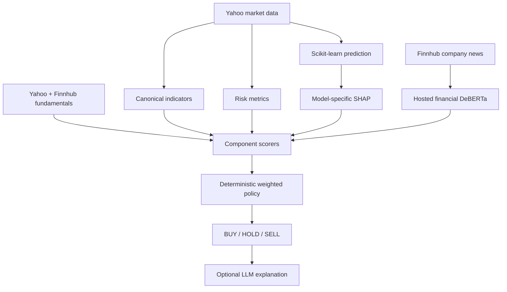

# Explainable Investment Platform Architecture

## Decision Boundary

The BUY/HOLD/SELL action is computed only by deterministic quantitative code.
An LLM can explain the resulting immutable payload, but it cannot produce or
change the action, score, confidence, risk level, or component evidence.



## Backend Modules

| Module | Responsibility |
| --- | --- |
| `features/technical_indicators.py` | Single vectorized source for price, trend, momentum, volatility, volume, Ichimoku, and structure indicators. |
| `fundamentals/service.py` | Normalizes Yahoo metrics and fills missing fields from Finnhub basic financials. |
| `sentiment/service.py` | Calls the configured finance classifier and returns three-way probabilities. Missing inference produces neutral with zero confidence, not a guessed score. |
| `risk/metrics.py` | Volatility, Sharpe, beta, drawdown, historical VaR/ES, Sortino, volatility regime, liquidity, tail, and sector risk. |
| `explainability/service.py` | `TreeExplainer` for random forests and `LinearExplainer` in the scaled linear-model feature space. |
| `recommendation_engine/` | Independent scorers plus configurable confidence-weighted policy and investor-profile guards. |
| `portfolio/analytics.py` | Allocation, exposures, shrinkage covariance, risk contribution, frontier, Monte Carlo, and rebalancing. |
| `portfolio/jobs.py` | Bounded background execution for expensive portfolio requests. |
| `portfolio/persistence.py` | Auth-scoped Supabase portfolio storage. |

## API Surface

All routes remain under the existing `/api/v1` prefix.

| Method | Route | Purpose |
| --- | --- | --- |
| `GET` | `/recommendation/{ticker}` | Personalized deterministic recommendation. |
| `POST` | `/recommendation/explain` | LLM explanation of an immutable recommendation. |
| `GET` | `/prediction/explanation?ticker=...` | Local feature contributions and uncertainty. |
| `POST` | `/portfolio/parse-csv` | Strict CSV parser with common broker column aliases. |
| `POST` | `/portfolio/analyze` | Synchronous portfolio analysis. |
| `POST` | `/portfolio/analyze-watchlist` | Equal-weight analysis of the authenticated watchlist. |
| `POST` | `/portfolio/jobs` | Submit bounded background analysis. |
| `GET` | `/portfolio/jobs/{job_id}` | Poll background analysis. |
| `POST` | `/portfolio/explain` | LLM explanation of immutable portfolio analytics. |
| `POST/GET` | `/portfolios` | Save or list authenticated portfolios. |

The original `/stock/{ticker}` response remains backward compatible.

## Recommendation Policy

Each scorer returns:

```json
{
  "score": -1.0,
  "confidence": 0.0,
  "reason": "Human-readable evidence",
  "evidence": [],
  "metrics": {}
}
```

The engine normalizes the confidence-weighted signal over available components.
Missing data reduces coverage and confidence. BUY additionally requires:

- configured overall score and confidence thresholds;
- minimum evidence coverage;
- at least two positive non-prediction components;
- the investor profile's risk guard.

Defaults and all thresholds live in `recommendation_engine/config.py`.
Component weights can be overridden with `RECOMMENDATION_WEIGHTS_JSON`.

## Portfolio Method

- Prices are date-normalized and aligned on overlapping observations.
- Expected returns use a 126-session exponentially weighted estimate with
  declared winsorization bounds.
- Covariance uses scikit-learn `LedoitWolf`, avoiding unstable inversion of a
  small-sample covariance matrix.
- The efficient frontier and maximum-Sharpe allocation use SciPy SLSQP with
  long-only, fully invested, maximum-weight constraints.
- Risk contribution is Euler variance contribution.
- Monte Carlo simulates 2,500 one-year portfolio return paths with a fixed seed
  for reproducibility.
- Suggested changes below 2% are classified as HOLD to limit churn.

## Failure and Cache Semantics

- Market/provider failures are surfaced per holding where partial portfolio
  analysis remains valid.
- Missing sentiment is excluded through zero confidence.
- Missing SHAP falls back to a declared degraded local ablation explanation;
  the API never labels it as SHAP.
- Recommendation, provider, news, and metadata results have endpoint-specific
  TTLs.
- Expensive portfolio jobs are limited to two concurrent tasks and expire
  after one hour.

## Persistence and Security

Migration `20260726000100_explainable_portfolios.sql` creates `portfolios` and
`portfolio_holdings`, foreign keys to `auth.users`, indexes, constraints, and
owner-only RLS policies. Service-role credentials and Hugging Face tokens remain
backend-only. No additional Vercel secret is required.
